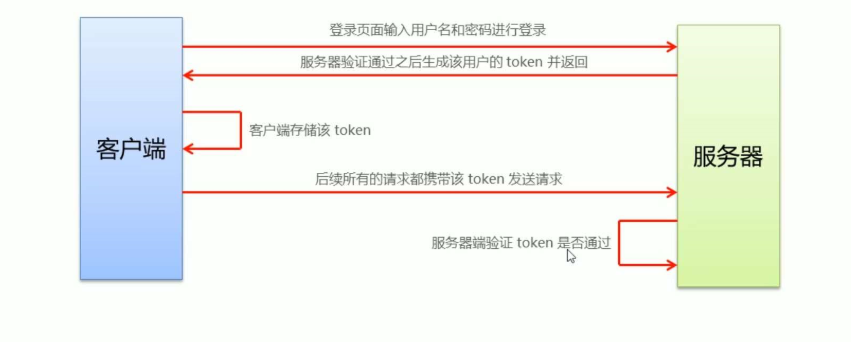
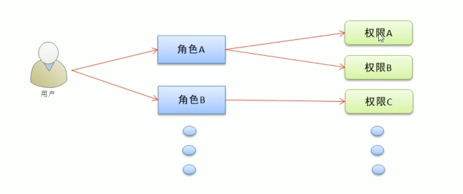

# vue_shop

## Project setup
```
npm install
```

### Compiles and hot-reloads for development
```
npm run serve
```

### Compiles and minifies for production
```
npm run build
```

### Lints and fixes files
```
npm run lint
```

### Customize configuration
See [Configuration Reference](https://cli.vuejs.org/config/).

# 1、登录/退出功能

## 1.1 登录概述

- 登录业务流程
  - 在登录页面输入用户名和密码
  - 调用后台接口进行验证
  - 通过验证之后，根据后台的响应状态跳转到项目主页
- 登录业务的相关技术点
  - http 是无状态的
  - 通过 cookie 在客户端记录状态
  - 通过session 在服务端记录状态
  - 通过 token 方式维持状态

## 1.2 登录 --- token 原理



## 1.3  登录逻辑实现

- 讲登录成功之后的 token（登录接口给返），保存到客户端的 sessionStorage 中
  - 项目中除了登录之外的其他API接口，必须在登录之后才能访问
  - toke 只应在当前网站打开期间生效，所以将 token 保存在 sessionStorage 中
- 通过编程式导航跳转到后台主页，路由地址是 /home

## 1.4 登录功能实现

- 路由导航守卫控制访问权限

  - 如果用户没有登录，但是直接通过 URL 访问特定页面，需要重新导航到登录页面

  ```javascript
  // 为路由对象， 添加 beforeEach 导航守卫
  router.beforeEach((to, from, next) => {
    // 如果用户访问的登录页面，直接放行
    if (to.path === '/login') return next()
    // 从 sessionStorage 中获取到 保存的 token 值
    const tokenStr = window.sessionStorage.getItem('_tokenName')
    // 没有token，强制跳转到登录页
    if (tokenStr) return next('/login')
    // 有 token 正常放行
    next()
  })
  ```

## 1.5 退出功能实现

- 基于 token 的方式实现退出比较简单，只需要销毁本地的 token 即可。这样，后续的请求就不会携带token，必须重新登录生成一个新的 token 之后才可以访问页面。

```javascript
// 清空 token
window.sessionStorage.clear()
// 跳转到登录页
this.$router.push('/login')
```

# 2、主页布局

## 2.1 通过接口获取菜单数据

- 通过 axios 请求拦截器添加 token，保证拥有获取数据的权限

```javascript
// axios 请求拦截 发起请求优先使用 use 回调
service.interceptors.request.use(config => {
  // config 是请求对象
  // 为请求头对象，添加 Token 验证的 Authorization 字段
  config.headers.Authorization = window.sessionStorage.getItem('_tokenName')
  // 最后必须 return config
  return config
})
```

# 3、权限管理

## 3.1 权限管理业务分析

- 通过权限管理模块控制不同的用户可以进行哪些操作，具体可以通过角色的方式进行控制，即每个用户分配一个特定的角色，角色包括不同的功能权限

  

# 4、富文本编辑器的使用

- 安装

```shell
 npm i vue-quill-editor
```

# 5、使用lodash

- 安装

```shell
 npm i lodash
```

- 作用：提供便捷的js  api
- 使用：

```javascript
import _ from 'lodash'
// 深拷贝
const obj = _cloneDeep(拷贝的对象)
```

# 6、优化

## 6.1 在执行build命令期间移除所有的console

```shell
npm install babel-plugin-transform-remove-console --save-dev
```

```javascript
// babel.config.js
module.exports = {
  presets: [
    '@vue/cli-plugin-babel/preset'
  ],
  plugins: [
    [
      'component',
      {
        libraryName: 'element-ui',
        styleLibraryName: 'theme-chalk'
      }
    ],
    // 打包移除 console
    'transform-remove-console'
  ]
}
```

## 6.2 只在发布阶段移除所有的 console

```javascript
// babel.config.js
// 这是项目发布阶段需要用到的 babel 插件
const prodPlugins = []
if (process.env.NODE_ENV === 'production') {
  prodPlugins.push('transform-remove-console')
}
module.exports = {
  presets: [
    '@vue/cli-plugin-babel/preset'
  ],
  plugins: [
    [
      'component',
      {
        libraryName: 'element-ui',
        styleLibraryName: 'theme-chalk'
      }
    ],
    // 发布产品时候的插件数组
    ...prodPlugins
    // build 移除 console
    // 'transform-remove-console'
  ]
}

```

# 7、项目优化

## 7.1 项目优化策略

- 生成打包报告

打包时，为了直观地发现项目中存在的问题，可以在打包时生成报告。生成报告的方式有两种：

（1）通过命令行参数的形式生成报告

```shell
# 通过 vue-cli 的命令选项可以生成打包报告
# --report 选项可以生成 report.html 以帮助分析包内容
vue-cli-service build --report
```

 （2）通过可视化的 UI 面板直接查看报告（推荐）

在可视化的UI面板中，通过`控制台` 和 `分析` 面板，可以方便地看到项目中所存在的问题。

## 7.2 通过 vue.config.js 修改 webpack 的默认配置

通过 vue-cli 3.0 工具生成的项目，`默认隐藏了所有 webpack 的配置项` ，目的是为了屏蔽项目的配置过程，让程序员把工作的重心，放到具体功能和业务逻辑的实现上。

如果程序员有修改 webpack 默认配置的需求，可以在项目根目录中，按需创建 `vue.config.js` 这个配置文件，从而对项目的打包发布过程做自定义的配置（具体配置参考 https://cli.vuejs.org/zh/config/#vue-config-js）

```javascript
// vue.config.js
// 这个文件中，应该导出一个包含了自定义配置选项的对象
module.exports = {
    // 选项...
}
```

## 7.3 为开发模式与发布模式指定不同的打包入口

默认情况下，Vue项目的 `开发模式` 与 `发布模式` ，共用一个打包入口文件（即`src/main.js`）。为了将项目的开发过程与发布过程分离，我们可以为两种模式，各自指定打包的入口文件，即：

（1）开发模式的入口文件为 `src/main-dev.js`

（2）发布模式的入口文件为 `src/main-prod.js`

## 7.4 configureWebpack 和 chainWebpack

在 vue.config.js 导出的配置对象中，新增 configureWebpack 或 chainWebpack 节点，来自定义 webpack 的打包配置。

在这里，configureWebpack 和 chainWebpack 的作用相同，唯一的区别就是他们修改 webpack 配置的方式不同：

（1）chainWebpack 通过 `链式编程` 的形式，来修改默认的 webpack 配置

（2）configureWebpack 通过 `操作对象` 的形式，来修改默认的 webpack 配置

两者具体的使用差异，可参考如下网址：

https://cli.vuejs.org/zh/guide/webpack.html#webpack-%E7%9B%B8%E5%85%B3

## 7.5 通过 chainwebpack 自定义打包入口

代码示例如下：

```javascript
// vue.config.js
module.exports = {
  chainWebpack: config => {
    // 判断是否处于生产模式 (固定写法)
    config.when(process.env.NODE_ENV === 'production', config => {
      // 获得默认打包入口清除并添加
      config.entry('app').clear().add('./src/main-prod.js')
    })
    // 判断是否处于开发模式 (固定写法)
    config.when(process.env.NODE_ENV === 'development', config => {
      // 获得默认打包入口清除并添加
      config.entry('app').clear().add('./src/main-dev.js')
    })
  }
}
```

## 7.6 通过 externals 加载外部 CDN 资源

默认情况下，通过 import 语法导入的第三方依赖包，最终会被打包合并到同一个文件中，从而导致打包成功后，单文件体积过大的问题。

为了解决上述问题，可以通过 webpack 的 externals 节点，来配置并加载外部的 CDN 资源。凡是声明在 externals 中的第三方依赖包，都不会被打包。

具体配置如下：

```javascript
config.set('externals', {
    // key是包的名字，value是引入的全局对象，即 import 后面跟着的对象
    vue: 'Vue',
    'vue-router': 'VueRouter',
    axios: 'axios',
    lodash: '_',
    echarts: 'echarts',
    nprogress: 'NProgress',
    'vue-quill-editor': 'VueQuillEditor'
})
```

同时，需要在 public/index.html 文件的头部，添加如下的 CDN 资源引用（生产环境不用Import引入样式）

```html
<!-- nprogress 的样式表文件 -->
<link href="https://cdn.staticfile.org/nprogress/0.2.0/nprogress.min.css" rel="stylesheet">
<!-- 富文本编辑器 的样式表文件 -->
<link href="https://cdn.staticfile.org/quill/1.3.7/quill.core.min.css" rel="stylesheet">
<link href="https://cdn.staticfile.org/quill/1.3.7/quill.snow.min.css" rel="stylesheet">
<link href="https://cdn.staticfile.org/quill/1.3.7/quill.bubble.min.css" rel="stylesheet">
```

同时：还需要在 public/index.html 文件的头部，添加如下的 CDN 资源引用

```html
<script src="https://cdn.staticfile.org/vue/2.6.11/vue.min.js"></script>
<script src="https://cdn.staticfile.org/vue-router/3.2.0/vue-router.min.js"></script>
<script src="https://cdn.staticfile.org/axios/0.19.2/axios.min.js"></script>
<script src="https://cdn.staticfile.org/lodash.js/4.17.2/lodash.min.js"></script>
<script src="https://cdn.staticfile.org/echarts/4.8.0/echarts.min.js"></script>
<script src="https://cdn.staticfile.org/nprogress/0.2.0/nprogress.min.css"></script>
<!-- 富文本编辑器的 js 文件-->
<script src="https://cdn.staticfile.org/quill/1.3.7/quill.min.js"></script>
<script src="https://cdn.jsdelivr.net/npm/vue-quill-editor@3.0.6/dist/vue-quill-editor.min.js"></script>
```

## 7.7 通过 CDN优化 ElementUI 打包

虽然在开发阶段，我们启用了 element-ui 组件的按需加载，尽可能的减少了打包的体积，但是那些被按需加载的组件，还是占用了较大的文件体积。此时，我们可以将 element-ui 中的组件，也通过 CDN 的形式来加载，这样能够进一步减小打包后的文件体积

具体操作流程如下：

（1）在 main-prod.js 中，注释掉 element-ui 按需加载的代码

（2）在 index.html 的头部区域中，通过 CDN 加载 element-ui 的 js 和 css 样式

```html
<script src="https://cdn.staticfile.org/element-ui/2.4.5/index.js"></script>
<link href="https://cdn.staticfile.org/element-ui/2.4.5/theme-chalk/index.css" rel="stylesheet">

```

## 7.8 首页内容定制

不同的打包环境下，首页内容可能会有所不同，我们可以通过插件的方式进行定制，插件配置如下：

```javascript
chainWebpack: config = {
    config.when(process.env.NODE_ENV === 'production', config => {
    	config.plugin('html').tap(args => {
            args[0].isProd = true
            return args
        })
	})
    config.when(process.env.NODE_ENV === 'development', config => {
    	config.plugin('html').tap(args => {
            args[0].isProd = false
            return args
        })
	})
}
```

在 public/index.html 首页中，可以根据 isProd(自定义变量)的值，来决定如何渲染页面的结构：

```html
<!-- 按需渲染页面的标题 -->
<title><%= htmlWebpackPlugin.options.isProd ? '' : 'dev - '%>电商后台管理系统</title>
    
<!-- 按需加载外部的 CDN 资源 -->
<%= if(htmlWebpackPlugin.options.isProd) {%>
    <!-- 通过 externals 加载外部 CDN 资源 -->
<% } %>
```

## 7.9 路由懒加载

当打包构建项目时，javaScript 包会变得非常大，影响页面加载，如果我们能把不同路由对应的组件分割成不同的代码块，然后当路由被访问的时候才加载对应组件，这样就更加高效了。

具体需要 3 步

（1）安装 `@babel/plugin-syntax-dynamic-import` 包

（2）在 `babel.config.js` 配置文件中声明该插件

（3）将路由改为按需加载的形式，示例代码如下：

```javascript
const Foo = () => important(/* webpackChunkName: "group-foo" */ './Foo.vue')
const Bar = () => important(/* webpackChunkName: "group-foo" */ './Bar.vue')
const Baz = () => important(/* webpackChunkName: "group-boo" */ './Baz.vue')
```

关于路由懒加载的详细文档，可参考如下链接：

https://router.vuejs.org/zh/guide/advanced/lazy-loading.html#%E6%8A%8A%E7%BB%84%E4%BB%B6%E6%8C%89%E7%BB%84%E5%88%86%E5%9D%97

# 8、项目上线（相关配置）

## 8.1 通过 node 创建 web 服务器

创建 node 项目，并安装 express，通过 express 快速创建 web服务器，将 vue 打包生成的 dist 文件夹，托管为静态资源即可，关键代码如下： 

```javascript
const express = require('express')
// 创建 web 服务器
const app = express()

// 托管静态资源
app.use(express.static('./dist'))

// 启动 web 服务器
app.listen(80, () => {
    console.log('web server runing at http://127.0.0.1:80')
})
```

## 8.2 开启 gzip 配置

使用 `gzip` 可以减小文件体积，使传输速度更快

可以通过服务端使用 express 做 gzip 压缩。其配置如下：

```javascript
// 安装相应包
npm install compression -D
// 导入包
const compression = require('compression')
// 启用中间件 注意顺序，必须在托管静态资源代码前面
app.use(compression())
```

## 8.3 配置 HTTPS 服务

为什么要启用 HTTPS 服务？

- 传统的 HTTP 协议传输的数据都是明文，不安全
- 采用 HTTPS 协议对传输的数据进行了加密处理，可以防止数据被中间人窃取，使用更安全

申请 SSL 证书（https://freessl.org)

（1）进入 https://freessl.cn/ 官网，输入要申请的域名并选择品牌

（2）输入自己的邮箱并选择相关选项

（3）验证 DNS （在域名管理后台添加 TXT 记录）

（4）验证通过之后，下载 SSL 证书（full_chain.pem公钥；private.key私钥）

# Git补充

- 创建并切换分支

```shell
# -b 创建 checkout 切换
git checkout -b 分支名
```

- 查看分支

```shell
git branch
```

- 查看状态

```shell
git status
```

- 暂存更改

```shell
git add .
```

- 提交到本地代码库

```shell
# -m 消息
git commit -m '提交信息'
```

- 切换分支

```shell
# checkout切换分支，切到 master 分支
git checkout master
```

- 合并本地分支

```shell
# 把 login 分支的代码合并到 当前分支下，即 master 分支
git merge login
```

- 推送到云端码云版本库中

```shell
git push
```

- 把本地 login 分支推送到云端

```shell
# 云端没有login分支
# 本地切换到 login 分支，origin 后面跟着是云端的分支名（新的分支）
git push -u origin login
```

